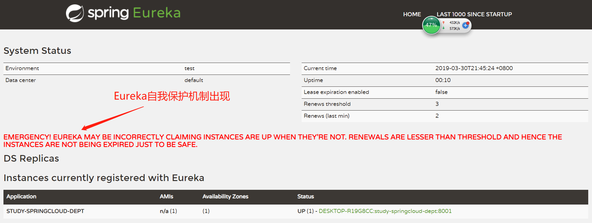

# Spring Cloud学习笔记


## 一、工程环境搭建

spring cloud版本：Dalston.SR1

spring boot版本：1.5.19.RELEASE

### 1、父工程搭建

- 新建springcloud-study 父工程

  pom文件

```xml
<?xml version="1.0" encoding="UTF-8"?>
<project xmlns="http://maven.apache.org/POM/4.0.0" xmlns:xsi="http://www.w3.org/2001/XMLSchema-instance"
         xsi:schemaLocation="http://maven.apache.org/POM/4.0.0 http://maven.apache.org/xsd/maven-4.0.0.xsd">
    <modelVersion>4.0.0</modelVersion>
    <groupId>com.gxs.springcloud</groupId>
    <artifactId>springcloud-study</artifactId>
    <version>1.0-SNAPSHOT</version>
    <packaging>pom</packaging>
    <properties>
        <project.build.sourceEncoding>UTF-8</project.build.sourceEncoding>
        <maven.compiler.source>1.8</maven.compiler.source>
        <maven.compiler.target>1.8</maven.compiler.target>
        <junit.version>4.12</junit.version>
        <log4j.version>1.2.17</log4j.version>
        <druid.version>1.1.10</druid.version>
        <spring-boot.version>1.5.19.RELEASE</spring-boot.version>
        <spring-cloud.version>Dalston.SR1</spring-cloud.version>
        <mysql-connector.version>5.1.47</mysql-connector.version>
        <mybatis-starter.version>1.3.3</mybatis-starter.version>
        <logback.version>1.2.3</logback.version>
        <lombok.version>1.18.6</lombok.version>
    </properties>

    <dependencyManagement>
        <dependencies>
            <dependency>
                <groupId>org.springframework.cloud</groupId>
                <artifactId>spring-cloud-dependencies</artifactId>
                <version>${spring-cloud.version}</version>
                <type>pom</type>
                <scope>import</scope>
            </dependency>
            <dependency>
                <groupId>org.springframework.boot</groupId>
                <artifactId>spring-boot-dependencies</artifactId>
                <version>${spring-boot.version}</version>
                <type>pom</type>
                <scope>import</scope>
            </dependency>
            <dependency>
                <groupId>mysql</groupId>
                <artifactId>mysql-connector-java</artifactId>
                <version>${mysql-connector.version}</version>
            </dependency>
            <dependency>
                <groupId>com.alibaba</groupId>
                <artifactId>druid</artifactId>
                <version>${druid.version}</version>
            </dependency>
            <dependency>
                <groupId>org.mybatis.spring.boot</groupId>
                <artifactId>mybatis-spring-boot-starter</artifactId>
                <version>${mybatis-starter.version}</version>
            </dependency>
            <dependency>
                <groupId>log4j</groupId>
                <artifactId>log4j</artifactId>
                <version>${log4j.version}</version>
            </dependency>
            <dependency>
                <groupId>ch.qos.logback</groupId>
                <artifactId>logback-core</artifactId>
                <version>${logback.version}</version>
            </dependency>
            <dependency>
                <groupId>junit</groupId>
                <artifactId>junit</artifactId>
                <version>${junit.version}</version>
                <scope>test</scope>
            </dependency>
        </dependencies>
    </dependencyManagement>
</project>
```

### 2 、构建公共子模块 springcloud-study-api

pom文件

```xml
<?xml version="1.0" encoding="UTF-8"?>
<project xmlns="http://maven.apache.org/POM/4.0.0" xmlns:xsi="http://www.w3.org/2001/XMLSchema-instance"
         xsi:schemaLocation="http://maven.apache.org/POM/4.0.0 http://maven.apache.org/xsd/maven-4.0.0.xsd">

    <modelVersion>4.0.0</modelVersion>
    <parent>
        <groupId>com.gxs.springcloud</groupId>
        <artifactId>springcloud-study</artifactId>
        <version>1.0-SNAPSHOT</version>
    </parent>

    <artifactId>springcloud-study-api</artifactId>

</project>
```

### 3、构建服务提供者 springcloud-study-provider-dept-8001

pom文件

```xml
<?xml version="1.0" encoding="UTF-8"?>
<project xmlns="http://maven.apache.org/POM/4.0.0" xmlns:xsi="http://www.w3.org/2001/XMLSchema-instance"
         xsi:schemaLocation="http://maven.apache.org/POM/4.0.0 http://maven.apache.org/xsd/maven-4.0.0.xsd">

    <modelVersion>4.0.0</modelVersion>
    <parent>
        <groupId>com.gxs.springcloud</groupId>
        <artifactId>springcloud-study</artifactId>
        <version>1.0-SNAPSHOT</version>
    </parent>

    <artifactId>springcloud-study-provider-dept-8001</artifactId>

    <dependencies>
        <dependency>
            <groupId>com.gxs.springcloud</groupId>
            <artifactId>springcloud-study-api</artifactId>
            <version>${project.version}</version>
        </dependency>
        <dependency>
            <groupId>junit</groupId>
            <artifactId>junit</artifactId>
        </dependency>
        <dependency>
            <groupId>mysql</groupId>
            <artifactId>mysql-connector-java</artifactId>
        </dependency>
        <dependency>
            <groupId>com.alibaba</groupId>
            <artifactId>druid</artifactId>
        </dependency>
        <dependency>
            <groupId>ch.qos.logback</groupId>
            <artifactId>logback-core</artifactId>
        </dependency>
        <dependency>
            <groupId>org.mybatis.spring.boot</groupId>
            <artifactId>mybatis-spring-boot-starter</artifactId>
        </dependency>
        <dependency>
            <groupId>org.springframework.boot</groupId>
            <artifactId>spring-boot-starter-jetty</artifactId>
        </dependency>
        <dependency>
            <groupId>org.springframework.boot</groupId>
            <artifactId>spring-boot-starter-web</artifactId>
        </dependency>
        <dependency>
            <groupId>org.springframework.boot</groupId>
            <artifactId>spring-boot-starter-test</artifactId>
        </dependency>
        <!--热部署 修改后立即生效-->
        <dependency>
            <groupId>org.springframework</groupId>
            <artifactId>springloaded</artifactId>
        </dependency>
        <dependency>
            <groupId>org.springframework.boot</groupId>
            <artifactId>spring-boot-devtools</artifactId>
        </dependency>

    </dependencies>

</project>
```

yml文件配置

```yml
#配置服务器信息
server:
  port: 8001
  #context-path: /study 配置根目录


#数据库信息配置
spring:
  application:
    name: study-springcloud-dept  #应用名称
  datasource:
    url: jdbc:mysql://localhost:3306/study?useUnicode=true&characterEncoding=UTF-8&serverTimezone=UTC&verifyServerCertificate=false&useSSL=false
    username: root
    password: root
    driver-class-name: com.mysql.jdbc.Driver
    type: com.alibaba.druid.pool.DruidDataSource

#druid连接池配置
    initialSize: 5
    minIdle: 5
    maxActive: 20
    maxWait: 60000
    timeBetweenEvictionRunsMillis: 60000
    minEvictableIdleTimeMillis: 300000
    validationQuery: SELECT 1 FROM DUAL
    testWhileIdle: true
    testOnBorrow: false
    testOnReturn: false
    poolPreparedStatements: true
    # 配置监控统计拦截的filters,去掉监控界面sql无法统计，‘wall’用于防火墙
    filters: stat,wall,log4j
    maxPoolPreparedStatementPerConnectionSize: 20
    userGlobalDataSourceStat: true
    connectionProperties: druid.stat.mergeSql=true;druid.stat.slowSqlMillis=500

#Mybatis配置
mybatis:
  mapper-locations: classpath:mapper/*.xml
  type-aliases-package: com.gxs.springcloud.entities
  configuration:
    map-underscore-to-camel-case: true #开启驼峰命名
    cache-enabled: true #开启二级缓存
```

### 4、构建服务消费者 springcloud-study-consumer-dept-80

pom文件配置

```xml
<?xml version="1.0" encoding="UTF-8"?>
<project xmlns="http://maven.apache.org/POM/4.0.0" xmlns:xsi="http://www.w3.org/2001/XMLSchema-instance"
         xsi:schemaLocation="http://maven.apache.org/POM/4.0.0 http://maven.apache.org/xsd/maven-4.0.0.xsd">

    <modelVersion>4.0.0</modelVersion>
    <parent>
        <groupId>com.gxs.springcloud</groupId>
        <artifactId>spring-cloud-study</artifactId>
        <version>1.0-SNAPSHOT</version>
    </parent>

    <artifactId>springcloud-study-consumer-dept-80</artifactId>

    <dependencies>
        <dependency>
            <groupId>com.gxs.springcloud</groupId>
            <artifactId>springcloud-study-api</artifactId>
            <version>${project.version}</version>
        </dependency>
        <dependency>
            <groupId>junit</groupId>
            <artifactId>junit</artifactId>
        </dependency>

        <dependency>
            <groupId>ch.qos.logback</groupId>
            <artifactId>logback-core</artifactId>
        </dependency>

        <dependency>
            <groupId>org.springframework.boot</groupId>
            <artifactId>spring-boot-starter-jetty</artifactId>
        </dependency>
        <dependency>
            <groupId>org.springframework.boot</groupId>
            <artifactId>spring-boot-starter-web</artifactId>
        </dependency>
        <dependency>
            <groupId>org.springframework.boot</groupId>
            <artifactId>spring-boot-starter-test</artifactId>
        </dependency>
        <!--热部署 修改后立即生效-->
        <dependency>
            <groupId>org.springframework</groupId>
            <artifactId>springloaded</artifactId>
        </dependency>
        <dependency>
            <groupId>org.springframework.boot</groupId>
            <artifactId>spring-boot-devtools</artifactId>
        </dependency>

    </dependencies>

</project>
```

yml配置

```yml
server:
  port: 80
```

主启动类

```java
@SpringBootApplication
public class DeptConsumer80App {
    public static void main(String[] args) {
        SpringApplication.run(DeptConsumer80App.class,args);
    }
}
```

# 二、Eureka配置


- 新建springcloud-study-euraka-7001工程，导入相关依赖

pom文件配置

```xml
<?xml version="1.0" encoding="UTF-8"?>
<project xmlns="http://maven.apache.org/POM/4.0.0" xmlns:xsi="http://www.w3.org/2001/XMLSchema-instance"
         xsi:schemaLocation="http://maven.apache.org/POM/4.0.0 http://maven.apache.org/xsd/maven-4.0.0.xsd">

    <modelVersion>4.0.0</modelVersion>
    <parent>
        <groupId>com.gxs.springcloud</groupId>
        <artifactId>spring-cloud-study</artifactId>
        <version>1.0-SNAPSHOT</version>
    </parent>

    <artifactId>springcloud-study-euraka-7001</artifactId>

    <dependencies>
        <!--eureka-server 服务端-->
        <dependency>
            <groupId>org.springframework.cloud</groupId>
            <artifactId>spring-cloud-starter-eureka-server</artifactId>
        </dependency>
        <!--热部署 修改后立即生效-->
        <dependency>
            <groupId>org.springframework</groupId>
            <artifactId>springloaded</artifactId>
        </dependency>
        <dependency>
            <groupId>org.springframework.boot</groupId>
            <artifactId>spring-boot-devtools</artifactId>
        </dependency>

    </dependencies>

</project>
```

yml文件配置

```yml
server:
  port: 7001
eureka:
  instance:
    hostname: localhost #eureka服务端的实例名称
  client:
    register-with-eureka: false #false表示不向注册中心注册自己
    fetch-registry: false #false 表示自己就是注册中心，职责就是维护服务实例，并不需要去检索服务
    service-url:
      defaultZone: http://${eureka.instance.hostname}:${server.port}/eureka/ #设置与eureka server 交互的地址查询服务和注册服务都需要依赖的地址
```

## 1、将服务注册进Eureka

- 8001provider服务中添加配置

```xml
<!--将微服务provider注册进eureka-->
        <dependency>
            <groupId>org.springframework.cloud</groupId>
            <artifactId>spring-cloud-starter-eureka</artifactId>
        </dependency>

        <dependency>
            <groupId>org.springframework.cloud</groupId>
            <artifactId>spring-cloud-starter-config</artifactId>
        </dependency>
```

- 修改8001的yml配置

```yml
#客户端注册进eureka服务列表
eureka:
  client:
    service-url:
      defaultZone: http://localhost:7001/eureka
```

- 8001 启动类增加@EnableEurekaClient注解

```java
@SpringBootApplication
@EnableEurekaClient
public class DeptProvider8001App {

    public static void main(String[] args) {
        SpringApplication.run(DeptProvider8001App.class,args);
    }
}
```

- 注册成功，在7001的Eureka服务站中会显示


## 2、actuator与注册微服务信息完善

**actuator：在springboot中主管监控和配置**

- 主机名称、服务名称修改

  1、修改8001的yml配置

  ```yml
  eureka:
    client:
      service-url:
        defaultZone: http://localhost:7001/eureka
     #服务实例名称修改
    instance:
      instance-id: study-springcloud-dept8001
  ```

- 访问信息有ip信息提示

  修改8001yml配置

  ```yml
  #客户端注册进eureka服务列表
  eureka:
    client:
      service-url:
        defaultZone: http://localhost:7001/eureka
    instance:
      #服务实例名称修改
      instance-id: study-springcloud-dept8001
      #访问路径显示IP地址
      prefer-ip-address: true
  ```

- 微服务info内容详细信息

  1、修改8001的pom文件，增加actuator的配置

  ```xml
  <!--actuator监控自信息完善-->
  <dependency>
      <groupId>org.springframework.boot</groupId>
      <artifactId>spring-boot-starter-actuator</artifactId>
  </dependency>
  ```

  2、父工程pom文件修改，增加build信息

  ```xml
  <build>
          <!--finalName 父工程名称-->
          <finalName>spring-cloud-study</finalName>
          <resources>
              <resource>
                  <directory>src/main/resources</directory>
                  <!--过滤开启-->
                  <filtering>true</filtering>
              </resource>
  
          </resources>
         <!--增加插件-->
          <plugins>
              <plugin>
                  <groupId>org.apache.maven.plugins</groupId>
                  <artifactId>maven-resources-plugin</artifactId>
                  <!--配置插件解析-->
                  <configuration>
                      <delimiters>
                          <delimit>$</delimit>
                      </delimiters>
                  </configuration>
              </plugin>
          </plugins>
      </build>
  ```

  3、修改8001的yml，增加info信息

  ```yml
  info:
    app.name: study-springcloud-micoservices
    company.name: www.gxs.com
    build.artifactId: $project.artifactId$
    build.version: $project.version$
  ```

  

## 3、Eureka自我保护机制



- Netflix在设置Eureka时，遵循AP原则

- 某时刻某一微服务不可用时，eureka不会立刻清理，依旧会对改微服务的信息进行保存。服务失去心跳、名称变更、网络拥堵

- **自我保护机制：**应对网络异常的安全措施

  默认情况下，如果EurekaServer在一定时间内没有接收到某个微服务实例的心跳，EurekaServer将会注销实例（默认90秒）。但是当网络分区故障发生时，微服务与EurekaServer之间无法正常通信，以上行为可能变得非常危险——因为微服务本身其实是健康的，==此时本不应该注销这个服务==。Eureka通过“自我保护模式”来解决这个问题——当EurekaServer节点再短时间内丢失过多客户端时（可能发生网络故障），那么这个节点就会进入自我保护模式。一旦进去该模式，EurekaServer就会保护服务注册表中的信息，不再删除服务注册表中的数据（也即不会注销任何微服务）。当网络故障恢复后，改EurekaServer节点会自动退出自我保护模式。

  ==宁可保护错误的注册信息，也不盲目注销任何可能健康的微服务实例==

  #### 禁用自我保护机制

  可以使用eureka.server.enable-self-preservation=false

## 4、Eureka服务发现

   对于注册进eureka里面的服务，可以通过服务发现获得该服务的信息

  ==供消费者调用==

  ##### 1、添加服务发现接口

  在8001工程的Controller类中增加DiscoveryClient

  ```java
  @Autowired
  private DiscoveryClient discoveryClient;
  ```

  ##### 2、增加自己服务描述的接口

  ```java
  @RequestMapping(value = "/dept/discovery",method = RequestMethod.GET)
  public Object discovery(){
      List<String> list = discoveryClient.getServices();
      List<ServiceInstance> instances = discoveryClient.getInstances("STUDY-SPRINGCLOUD-DEPT");
  
      for (ServiceInstance element :instances){
          System.out.println(element.getServiceId());
          System.out.println(element.getHost());
          System.out.println(element.getPort());
          System.out.println(element.getUri());
      }
      return this.discoveryClient;
  
  }
  ```

  ##### 3、8001主启动类中增加 @@EnableDiscoveryClient注解

  ##### 4、启动，调用<http://localhost:8001/dept/discovery>

  8001需要等待注入一段时间，注入进server

  ##### 5、在80消费端中增加相应调用

  ```java
  @RequestMapping(value = "/consumer/dept/discovery")
  public Object discovery(){
      return  restTemplate.getForObject(
              REST_URL_PREFIX+"/dept/discovery",
              Object.class);
  }
  ```

## 5、Eureka集群配置


  ### 1、新建7002、7003Eureka服务项目

复制7001的pom、yml文件

  ### 2、修改域名映射，修改host文件

==必须修改，否则不成功==


### 3、台Eureka的yml配置


修改7001、7002、7003对应的yml配置

```yml
service-url:
  # 单机版配置defaultZone: http://${eureka.instance.hostname}:${server.port}/eureka #设置与eureka server 交互的地址查询服务和注册服务都需要依赖的地址
  #集群配置
  defaultZone: http://localhost:7001/eureka,http://localhost:7002/eureka
```

### 4、在8001配置注册

修改yml中集群的配置，使8001同时注册进7001-3集群环境

```yml
eureka:
  client:
    service-url:
      defaultZone: http://localhost:7001/eureka,http://localhost:7002/eureka,http://localhost:7003/eureka
```


**至此有三个eureka集群，一个微服务提供者**

### 5、Eureka与Zookeeper的区别

- CAP理论

  - C：consistency 强一致性

  - A：Availability 可用性 （HA高可用）

  - P：Partition tolerance 分区容错性

    

- Eureka遵循AP原则

  弱一致性

  各个节点平等，不存在主存，只要有一台就能保证服务可用，但是可能不是最新的

  网络稳定，当前新注册的服务才会同步到其他节点

- Zookeeper遵循CP理论

  问题：当master节点由于网络故障，与其他节点失去联系，剩余节点重新进行leader选举。问题在于，选举leader的时间太长，且选举期间zk集群不可用，导致注册服务瘫痪。

# 三、Ribbon负载均衡

## 1、概述

基于Netflix ribbon实现的一套 ==客户端、负载均衡的工具==

重要功能是提供==客户端的软件负载均衡算法==，Ribbon客户端组件提供一系列的配置项如链接超时、重试等

官网资料：

常见的负载均衡：软件Nginx、LVS 硬件F5


# 四、Feign负载均衡


# 五、Hystrix 断路器


# 六、zuul路由网关


# 七、SpringCloud Config 分布式配置中心


  

  

  

  

  

  

  

